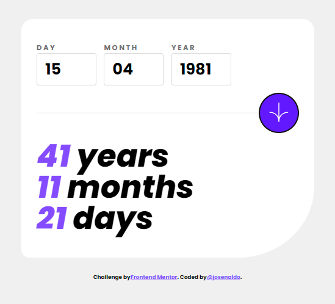

# Frontend Mentor - Age calculator app solution

This is a solution to the [Age calculator app challenge on Frontend Mentor](https://www.frontendmentor.io/challenges/age-calculator-app-dF9DFFpj-Q). Frontend Mentor challenges help you improve your coding skills by building realistic projects.

## Table of contents

- [Frontend Mentor - Age calculator app solution](#frontend-mentor---age-calculator-app-solution)
  - [Table of contents](#table-of-contents)
  - [Overview](#overview)
    - [The challenge](#the-challenge)
    - [Screenshot](#screenshot)
    - [Links](#links)
  - [My process](#my-process)
    - [Built with](#built-with)
    - [What I learned](#what-i-learned)
    - [Continued development](#continued-development)
  - [Author](#author)
  - [Acknowledgments](#acknowledgments)

## Overview

### The challenge

Users should be able to:

- View an age in years, months, and days after submitting a valid date through the form
- Receive validation errors if:
  - Any field is empty when the form is submitted
  - The day number is not between 1-31
  - The month number is not between 1-12
  - The year is in the future
  - The date is invalid e.g. 31/04/1991 (there are 30 days in April)
- View the optimal layout for the interface depending on their device's screen size
- See hover and focus states for all interactive elements on the page
- **Bonus**: See the age numbers animate to their final number when the form is submitted

### Screenshot

### Links

- Solution URL: <https://github.com/josenaldo/age-calculator-app>
- Live Site URL: <https://age-calculator-app-six.vercel.app/>

## My process

### Built with

- [My Vite React starter template](https://github.com/josenaldo/vite-js-react-minimal)
- [React](https://reactjs.org/) - JS library
- [Vite](https://vitejs.dev/) - Build tool that serves your code via native ES Module imports during development
- Mobile-first workflow
- [Reac Hook Form](https://react-hook-form.com/) - Performant, flexible and extensible forms with easy-to-use validation.
- [Date-fns](https://date-fns.org/) - Modern JavaScript date utility library

### What I learned

I created this project to put into practice the skills I have been learning over the last few months. I have been studying the [Full Stack open Course](https://fullstackopen.com/en/) from the University of Helsinki, where I learned a lot about different technologies such as React, Node.js, Express, MongoDB, GraphQL, and TypeScript.

During the development of this project, I was able to use the [React Hook Form](https://react-hook-form.com/) library, which I had used in previous projects. I find this library to be very easy to use and performant. I was also able to use Flexbox to position elements on the screen and the `clamp` function in CSS to resize elements gradually, avoiding the use of media queries.

In addition, I used the [Vite](https://vitejs.dev/) build tool in this project instead of Create React App (CRA), which made the development process faster and more efficient. I also used [degit](https://github.com/Rich-Harris/degit) to start the project from a [template](https://github.com/josenaldo/vite-js-react-minimal), which made it easier to get started quickly.

Overall, this project allowed me to apply my knowledge of React and other technologies in a practical way, while also learning new skills such as using Vite and degit.

### Continued development

Moving forward, I want to focus on refining and perfecting the skills I have learned in this project. Specifically, I want to improve my ability to create responsive interfaces with minimal use of media queries. Although I found the clamp function interesting, I need to use it more efficiently so that the resizing of elements looks more fluid, proportional, and harmonious.

I also want to deepen my knowledge of the React Hook Forms library. My next step is to use it to create reusable form components for a project. I believe that this will help me to understand the library better and improve my skills in creating forms in React.

## Author

👤 **Josenaldo de Oliveira Matos Filho**

- Website: <josenaldo.github.io>
- Twitter: [@josenaldomatos](https://twitter.com/josenaldomatos)
- Github: [@josenaldo](https://github.com/josenaldo)
- LinkedIn: [@josenaldo](https://linkedin.com/in/josenaldo)

## Acknowledgments

Thanks to:

- [Frontend Mentor](https://www.frontendmentor.io) for providing the challenge
- [Helssinki University](https://fullstackopen.com/en/) for providing the course
- [Matti Luukkainen](https://github.com/mluukkai) - for the course
